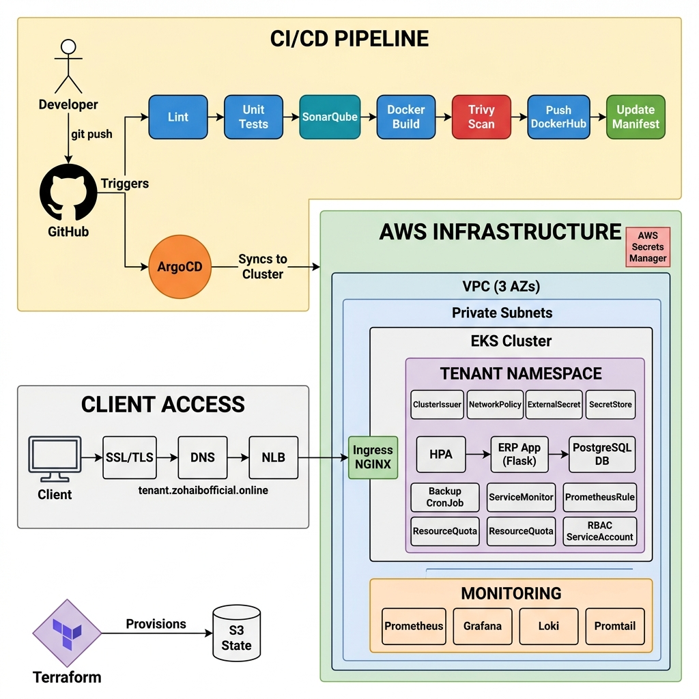

# Self-Service ERP Deployment Platform

A production-grade, multi-tenant ERP deployment platform built on Kubernetes and GitOps principles. This platform automates the entire lifecycle of tenant ERP instances — from infrastructure provisioning to continuous deployment, observability, security hardening, and disaster recovery.

---

## Table of Contents

- [Architecture Overview](#architecture-overview)
- [Repository Structure](#repository-structure)
- [Setup Instructions](#setup-instructions)
- [Deployment Flow](#deployment-flow)
- [Sample Tenant Onboarding Workflow](#sample-tenant-onboarding-workflow)
- [Security Considerations](#security-considerations)
- [Incident Recovery Guide](#incident-recovery-guide)
- [Cost Optimization Suggestions](#cost-optimization-suggestions)
- [Scaling Strategy](#scaling-strategy)

---

## Architecture Overview



The platform is composed of three repositories working together:

| Repository | Purpose |
|---|---|
| **erp-dummy-app** | Application source code, Dockerfile, CI pipeline (GitHub Actions) |
| **erp-gitops-config** | Helm charts, tenant configurations, ArgoCD application manifests (this repo) |
| **erp-gitops-platform** | Terraform IaC for provisioning AWS infrastructure (VPC, EKS, Helm releases) |

### Platform Components

| Component | Technology | Purpose |
|---|---|---|
| Infrastructure | Terraform + AWS EKS | VPC, subnets, managed Kubernetes cluster |
| GitOps Engine | ArgoCD | Automated sync from Git → Cluster |
| Ingress | NGINX Ingress Controller | TLS termination, routing per tenant subdomain |
| TLS Certificates | Cert-Manager + Let's Encrypt | Automatic HTTPS for every tenant |
| Secrets Management | External Secrets Operator + AWS Secrets Manager | Secure injection of DB credentials |
| Monitoring | Prometheus + Grafana + Loki + Promtail | Metrics, dashboards, alerting, log aggregation |
| CI Pipeline | GitHub Actions | Lint → Test → SonarQube → Trivy → Build → Push → Update GitOps |
| Backup | Kubernetes CronJob + PVC | Automated daily `pg_dump` with retention policy |

### How It Works (End-to-End Flow)

```
Developer pushes code
        ↓
GitHub Actions CI triggers
        ↓
Lint → Unit Tests → SonarQube → Trivy Scan → Docker Build & Push
        ↓
CI updates image tag in erp-gitops-config/values.yaml
        ↓
ArgoCD detects Git change → Syncs to Kubernetes
        ↓
Tenant namespace updated with new pods (zero-downtime rolling update)
        ↓
Prometheus scrapes metrics → Grafana displays dashboards → Alerts fire if needed
```

---

## Repository Structure

```
erp-gitops-config/
├── charts/
│   └── erp-base/                    # Reusable Helm chart for all tenants
│       ├── Chart.yaml
│       ├── values.yaml              # Default values (overridden per tenant)
│       └── templates/
│           ├── deployment.yaml      # ERP app Deployment (non-root, read-only FS)
│           ├── database.yaml        # PostgreSQL StatefulSet (non-root, PVC)
│           ├── service.yaml         # ClusterIP services for app & DB
│           ├── ingress.yaml         # NGINX Ingress with TLS
│           ├── configmap.yaml       # Tenant-specific configuration
│           ├── externalsecret.yaml  # AWS Secrets Manager integration
│           ├── hpa.yaml             # Horizontal Pod Autoscaler
│           ├── networkpolicy.yaml   # Zero-trust network policies
│           ├── rbac.yaml            # ServiceAccount (no API token)
│           ├── resourcequota.yaml   # CPU/Memory/Pod limits per namespace
│           ├── backup-pvc.yaml      # Dedicated backup storage volume
│           ├── backup-cronjob.yaml  # Automated daily DB backup
│           ├── servicemonitor.yaml  # Prometheus scrape target
│           ├── prometheusrule.yaml  # Alert rules (CPU, Memory, 5xx, Restarts)
│           └── grafana-dashboard.yaml # Auto-loaded Grafana dashboard
├── docs/
│   ├── architecture-diagram.png     # Visual architecture diagram
│   └── restore-process.md          # Step-by-step DB restore guide
└── README.md                       # This file
```

---

## Setup Instructions

### Prerequisites

- AWS account with appropriate IAM permissions
- `terraform` v1.5+ installed
- `kubectl` configured
- `helm` v3.12+ installed
- GitHub account with repository access
- Docker Hub account for image registry

### Step 1: Provision Infrastructure (Terraform)

```bash
# Clone the platform repository
git clone https://github.com/zohaibwarraich1/erp-gitops-platform.git
cd erp-gitops-platform/phase1-infrastructure

# Initialize and apply Terraform
terraform init
terraform plan
terraform apply
```

This provisions:
- **VPC** with 3 Availability Zones and private subnets
- **EKS Cluster** (managed Kubernetes)
- **NGINX Ingress Controller** with AWS NLB (internet-facing)
- **Cert-Manager** for automated TLS
- **External Secrets Operator** with IRSA for AWS Secrets Manager
- **Prometheus + Grafana + Loki** monitoring stack
- **ArgoCD** GitOps engine

### Step 2: Configure kubectl

```bash
aws eks update-kubeconfig --name erp-cluster --region us-east-1
kubectl get nodes  # Verify connectivity
```

### Step 3: Configure ArgoCD

```bash
# Get the ArgoCD admin password
kubectl -n argocd get secret argocd-initial-admin-secret -o jsonpath="{.data.password}" | base64 -d

# Port-forward to access ArgoCD UI
kubectl port-forward svc/argocd-server -n argocd 8080:443

# Login via CLI
argocd login localhost:8080 --username admin --password <password> --insecure
```

### Step 4: Store Secrets in AWS Secrets Manager

```bash
# Create a secret for each tenant in AWS Secrets Manager
aws secretsmanager create-secret \
  --name erp/ahmad/db-credentials \
  --secret-string '{"POSTGRES_PASSWORD":"<secure-password>"}'
```

### Step 5: Configure DNS

Point your wildcard domain to the NLB:
```
*.zohaibofficial.online → CNAME → <NLB-DNS-Address>
```

---

## Deployment Flow

### CI Pipeline (GitHub Actions)

Every push to `main` in the `erp-dummy-app` repository triggers the following pipeline:

```
┌──────────┐    ┌──────────┐    ┌───────────┐    ┌────────────┐    ┌───────────┐
│   Lint   │───→│  Tests   │───→│ SonarQube │───→│   Build &  │───→│  Update   │
│ (flake8) │    │ (pytest) │    │  Quality  │    │ Trivy Scan │    │  GitOps   │
│          │    │          │    │   Gate    │    │ Push Image │    │  Manifest │
└──────────┘    └──────────┘    └───────────┘    └────────────┘    └───────────┘
```

| Stage | Tool | Purpose |
|---|---|---|
| Lint | flake8 | Python code style enforcement |
| Unit Tests | pytest + coverage | Functional testing with 80%+ coverage |
| Code Quality | SonarQube Cloud | Static analysis, security hotspots, quality gate |
| Image Build | Docker | Multi-stage build, non-root user |
| Image Scan | Trivy | CVE scanning (CRITICAL/HIGH severity) |
| Push | Docker Hub | Store versioned container image |
| GitOps Update | yq + git push | Update `values.yaml` image tag → triggers ArgoCD |

### CD Pipeline (ArgoCD)

ArgoCD continuously monitors this repository. When a change is detected:

1. ArgoCD compares the desired state (Git) with the live state (cluster)
2. Automatically syncs differences (Self-Heal enabled)
3. Performs a rolling update (zero-downtime deployment)
4. Prunes orphaned resources (Prune enabled)

---

## Sample Tenant Onboarding Workflow

Onboarding a new tenant (e.g., `alrehman-traders`) takes only **3 steps**:

### Step 1: Create the AWS Secret

```bash
aws secretsmanager create-secret \
  --name erp/alrehman-traders/db-credentials \
  --secret-string '{"POSTGRES_PASSWORD":"SuperSecure123!"}'
```

### Step 2: Create an ArgoCD Application

```bash
kubectl apply -f - <<EOF
apiVersion: argoproj.io/v1alpha1
kind: Application
metadata:
  name: alrehman-traders
  namespace: argocd
spec:
  project: default
  source:
    repoURL: https://github.com/zohaibwarraich1/erp-gitops-config.git
    targetRevision: HEAD
    path: charts/erp-base
    helm:
      values: |
        tenant: alrehman-traders
        domain: alrehman-traders.zohaibofficial.online
        db_name: erp_alrehman_traders
        replicas: 3
        resources:
          limits:
            cpu: 500m
            memory: 512Mi
          requests:
            cpu: 250m
            memory: 256Mi
  destination:
    server: https://kubernetes.default.svc
    namespace: alrehman-traders
  syncPolicy:
    automated:
      prune: true
      selfHeal: true
    syncOptions:
      - CreateNamespace=true
EOF
```

### Step 3: Configure DNS

Add a CNAME record:
```
alrehman-traders.zohaibofficial.online → CNAME → <NLB-DNS>
```

**That's it!** ArgoCD will automatically:
- Create the `alrehman-traders` namespace
- Deploy the ERP application with 3 replicas (auto-scaling up to 10)
- Provision a PostgreSQL database with persistent storage
- Configure HTTPS via Let's Encrypt
- Apply network policies, resource quotas, RBAC
- Set up monitoring (Prometheus + Grafana dashboard)
- Schedule daily automated backups at 2 AM

---

## Security Considerations

Security is implemented at every layer of the platform following defense-in-depth principles:

### Container Security
| Control | Implementation |
|---|---|
| Non-root execution | All containers run as non-root users (UID 1000 for app, UID 999 for postgres) |
| Read-only filesystem | `readOnlyRootFilesystem: true` on all containers, `emptyDir` for `/tmp` |
| Capability dropping | `capabilities: drop: ["ALL"]` — no Linux capabilities granted |
| Privilege escalation | `allowPrivilegeEscalation: false` on all containers |

### Network Security
| Control | Implementation |
|---|---|
| Zero-trust policies | Default-deny NetworkPolicies per tenant namespace |
| ERP app ingress | Only accepts traffic from NGINX Ingress namespace and Prometheus |
| Database ingress | Only accepts traffic from same-namespace ERP pods and backup jobs |
| Database egress | Completely blocked — DB cannot initiate outbound connections |
| Backup egress | Only allowed to reach DB (port 5432) and DNS (port 53) |

### Access Control
| Control | Implementation |
|---|---|
| RBAC | Dedicated ServiceAccount per tenant with no API server access |
| Token mounting | `automountServiceAccountToken: false` — pods cannot query K8s API |
| Resource quotas | Hard limits on CPU, memory, and pod count per namespace |

### Secrets Management
| Control | Implementation |
|---|---|
| External Secrets Operator | Syncs secrets from AWS Secrets Manager to Kubernetes |
| IRSA | IAM Roles for Service Accounts — no static AWS credentials |
| No hardcoded secrets | All sensitive values are injected at runtime |

### Supply Chain Security
| Control | Implementation |
|---|---|
| Trivy scanning | Every Docker image is scanned for CRITICAL/HIGH CVEs before push |
| SonarQube | Static code analysis for security hotspots and code quality |
| Minimal base images | `python:3.9-slim` for app, `postgres:14-alpine` for database |

---

## Incident Recovery Guide

### Application Failure Recovery

**Scenario:** A bad deployment causes application errors.

```bash
# Option 1: ArgoCD Rollback (recommended)
argocd app history <tenant-name>        # List deployment history
argocd app rollback <tenant-name> <id>  # Rollback to a known-good version

# Option 2: Git Revert
cd erp-gitops-config
git revert HEAD   # Revert the last commit
git push          # ArgoCD auto-syncs to previous state
```

### Database Recovery

**Scenario:** Data corruption or accidental deletion.

Automated backups run daily at 2:00 AM and are stored on a dedicated PVC. Backups are retained for 7 days.

```bash
TENANT="ahmad"

# 1. Create a temporary pod to access backups
kubectl run ${TENANT}-restore --image=postgres:14-alpine \
  --overrides="{\"spec\":{\"containers\":[{\"name\":\"restore\",\"image\":\"postgres:14-alpine\",\"command\":[\"sleep\",\"3600\"],\"volumeMounts\":[{\"name\":\"backup\",\"mountPath\":\"/backup\"}]}],\"volumes\":[{\"name\":\"backup\",\"persistentVolumeClaim\":{\"claimName\":\"${TENANT}-backup-storage\"}}]}}" \
  -n ${TENANT}

# 2. List available backups
kubectl exec -it ${TENANT}-restore -n ${TENANT} -- ls -lh /backup

# 3. Restore from a backup file
DB_PASS=$(kubectl get secret ${TENANT}-db-credentials -n ${TENANT} -o jsonpath="{.data.POSTGRES_PASSWORD}" | base64 -d)
DB_NAME=$(kubectl get configmap ${TENANT}-config -n ${TENANT} -o jsonpath="{.data.DATABASE_NAME}")

kubectl exec -it ${TENANT}-restore -n ${TENANT} -- sh -c \
  "PGPASSWORD=${DB_PASS} psql -h ${TENANT}-db-svc -U postgres -d ${DB_NAME} < /backup/<backup_file>.sql"

# 4. Cleanup
kubectl delete pod ${TENANT}-restore -n ${TENANT}
```

For the full detailed guide, see [docs/restore-process.md](docs/restore-process.md).

### Cluster-Level Recovery

**Scenario:** Complete cluster failure.

Since the entire platform is defined as code, recovery is deterministic:

1. **Infrastructure:** Re-run `terraform apply` in `erp-gitops-platform` to recreate the cluster.
2. **Applications:** ArgoCD will automatically re-sync all tenant applications from this repository.
3. **Data:** Restore databases from backup PVCs (if using EBS-backed PVs, snapshots can be used).

---

## Cost Optimization Suggestions

| Strategy | Description | Estimated Savings |
|---|---|---|
| **Spot/Karpenter Nodes** | Use AWS Spot instances via Karpenter for non-critical workloads. Karpenter automatically selects the cheapest instance types that match pod requirements. | 60-90% on compute |
| **Right-size Resources** | Analyze Prometheus metrics (`container_cpu_usage_seconds_total`, `container_memory_working_set_bytes`) to right-size pod requests/limits. Over-provisioned pods waste money. | 20-40% on compute |
| **HPA + Scale-to-Zero** | Our HPA already scales pods dynamically (2→10). For non-production tenants, consider scaling `minReplicas` to 1 during off-hours. | 30-50% on compute |
| **Shared Database** | For small tenants, consider a shared PostgreSQL instance with logical databases instead of dedicated StatefulSets. | 50-70% on database compute |
| **EBS Volume Types** | Use `gp3` (cheaper) instead of `gp2` for PVCs. Configure `StorageClass` accordingly. | 20% on storage |
| **Reserved Instances** | For baseline workloads that run 24/7, purchase 1-year reserved instances for predictable capacity. | 30-40% on baseline compute |
| **Log Retention** | Loki is configured with 30-day retention. Adjust based on compliance needs to reduce storage costs. | Variable |
| **Namespace-Level Quotas** | ResourceQuotas prevent any single tenant from consuming excessive resources, protecting the cluster from cost spikes. | Risk mitigation |

---

## Scaling Strategy

### Application Level (Horizontal Pod Autoscaler)

Each tenant's ERP application is configured with an HPA that automatically scales based on resource utilization:

```yaml
# Current HPA Configuration
minReplicas: 2       # Minimum for high availability
maxReplicas: 10      # Maximum during peak load
metrics:
  - CPU: 70%         # Scale up when average CPU > 70%
  - Memory: 80%      # Scale up when average Memory > 80%
```

**How it works:**
1. Prometheus scrapes pod metrics via ServiceMonitor
2. Kubernetes Metrics Server provides real-time resource data to HPA
3. HPA evaluates target utilization every 15 seconds
4. Pods scale up/down smoothly with rolling updates

### Cluster Level (Node Scaling)

- **EKS Auto Mode / Karpenter:** Automatically provisions new nodes when pods are unschedulable due to resource constraints. Nodes are deprovisioned when idle.
- **Multi-AZ:** Nodes are spread across 3 Availability Zones for high availability.

### Database Level

- PostgreSQL runs as a StatefulSet with persistent storage (EBS-backed PVC).
- For horizontal database scaling, consider adding read replicas or migrating to AWS RDS with Multi-AZ.

### Monitoring-Driven Scaling Decisions

Our Grafana dashboard and Prometheus alerts provide the data needed to make informed scaling decisions:

| Metric | Alert Threshold | Action |
|---|---|---|
| CPU utilization | > 80% for 5 min | HPA auto-scales; review if maxReplicas is sufficient |
| Memory utilization | > 80% for 5 min | HPA auto-scales; consider increasing memory limits |
| HTTP 5xx errors | > 10/min | Investigate application issues; may need more replicas |
| Pod restarts | > 3 in 5 min | Investigate OOMKills or CrashLoops |

---

## Technologies Used

| Category | Tools |
|---|---|
| Cloud | AWS (EKS, VPC, Secrets Manager, NLB) |
| IaC | Terraform |
| Container Runtime | Docker |
| Orchestration | Kubernetes (EKS) |
| GitOps | ArgoCD |
| CI/CD | GitHub Actions |
| Package Management | Helm |
| Ingress | NGINX Ingress Controller |
| TLS | Cert-Manager + Let's Encrypt |
| Secrets | External Secrets Operator + AWS Secrets Manager |
| Monitoring | Prometheus + Grafana |
| Logging | Loki + Promtail |
| Code Quality | SonarQube Cloud |
| Image Scanning | Trivy |
| Backup | Kubernetes CronJob + pg_dump |

---

## License

This project is developed as part of a DevOps technical assignment.
